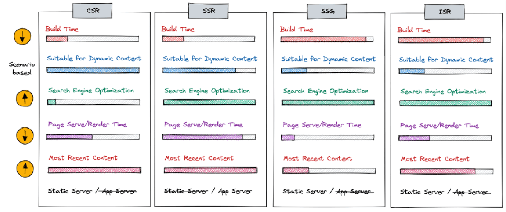

# Release Candidate
## TLA
<>
### CSR
Client side rendering, CSR is zwaar op je database en het kan liggen aan netwerk snelheid om je pagina's te renderen
### SSR
Sever Side Rendering, Client maakt verbinding met server en de server voert requesten uit en geeft de pagina's weer
### SSG
Tijdens de buildup wordt alles gerenderd hiermee kan het snel en eenvoudig renderen, nadeel is dat het statisch is dus je kan het moeilijk interactief maken.
### overall
Er zijn dus veel verschillende mogelijkheden, ieder heeft zn voor en nadelen dus kijk waar je opdracht het best bij past.
### CI
Continueud Intergration werkt met het automatiseren van het live reder process sneller te maken.

### SSG (& Content Delivery Network)
Voordelen:
- veiligheid
- performance
- Schaalbaarheid CDN
- Gratis hosting

Nadelen:
- Build time
- Minder dynamisch
- Content

- CSR - Client Site Rendering
- SSR - Server Site Rendering
- SSG - Static Site Generation
- CDN - Content Delivery Network
- CI - Continuous Intergration

## GSAP
GSAP werkt met js met tijdlijn animaties.

## Clean code & Refactoren
- Clean code
- Refactoring
- Sveltekit Best-Practices

### Clean code - Robert C. Martin
het schrijven van clean code is nodig om jezelf een proffesional te noemen
Code is wanneer het te lezen is door andere developers.
Leesbaar, aanpasbaar, uitbreidbaar en onderhoudbaar.
Boy scout rule - Laat de wereld er beter uitzien als dat je mee aankwam/maak je code mooier als dat je vond.
Verander variables met betere namen, split een groote functie in kleinere stukken.
- Betekenvolle namen voor variables, functies en bestanden
- Gebruik geen namen zoals a, x, data of temp.
- Schrijf kleine functies, lange zijn moeilijk te begrijpen
- Min mogelijke parameters *function(  x  )* in je functies
- Voorkom side-effects
- Gebruik goed comentaar als de code van zichzelf niet duidelijk genoeg is.
- bloke met comentaar code moet weg
- Maak code leesbaar(voor mensen)

### Refactoring
Refactoring is de code verbeteren in structuur zonder de functie aan te passen.
Het bestaat uit kleine veranderingen zoals hernoemen van variables.

- hernoem Functie declaratie dus ipv function ot(r, x){} dit: function omtrek(straal){}
- split conditionals zoals lange if statments
- Vervang loops door pipelines
- verwijderen van dode code
- verschuif statements dus bijv in js, alle const bij elkaar en niet tussendoor een let. (alt + pijltje)

### Slevtekit Best Practices

- voorkom het inladen van componenten die componenten inladen
- als een bestand te groot wordt moet zou je je script en style in losse bestanden neerzetten.
- performance.. Code-splitting, Asset preloading, file hashing, request coalescing, parallel loading, pre-rendering, link preloading

### performance tips
- Lighthouse test
- afbeeldingen @sveltejs/enhanced-img
- Sitemaps voor svelte

## WebGl/Shaders/Three.js
### Three.js
Three.js is een js library dat werken emt 3d voor browsers eenvoudig maakt.
- Scene = de wereld waar je objecten staan.
- Camera = de camera op welke angle je naar de 3d prompts kijkt.
- renderer = tekent de scene.

- mash = object

- Perspective camera = hiermee kun je perspectieven zien (3d)
- Orthographic camera = hiermee zie je geen perspectief (2d)

Meshes zijn basis objecten die intressanter worden gemaakt, matriaal kan je zien als kleur, dit geeft een kleine feeling aan 3d. Shaders maakt het een stuk meer realistischer.

Fragment shader, dit geeft schaduw en licht en is voornamelijk belangrijk voor ons.

(three.js lessen)[https://threejs-journey.com/#summary]
(three.js posts)[https://tympanus.net/codrops/?s=three.js&search-type=posts]

## Van offerte naar opdracht
Hoe kom je aan projecten? Netwerk, netwerk, netwerk

### Wat wilt de opdrachtgever
- Kennismaken
- Briefing
- Verwachtingen
- Wat wil jij, wat kan ik
- Past het niet? nee zeggen kan nogsteeds

"Plezier, Poen en Prestige"

### Offerte
Wat moet er in een offerte:
- Wat ga je doen
- Wat ga je NIET doen
- Begroting/budget
- plannen & Afspraken
- Algemene Voorwaarden

### Van schets naar ontwerp
- Grove schetsen laten zien
- Daarna high-fi
- Snel bouwen
- Design changes on the way

### Bouwen
- Fundering, data model
- Framework kiezen
- CMS, zeker doen
- Testen
- Acceptatie omgeving opzetten

Development omgeving (lokaal),
Test server(niet voor de klant),
Acceptatie omgeving (kan klant zien),
Productie omgeving(online voor iedereen)

### Oplevering
- Afspraken over opleveren (release niet op een vrijdag)
- Garantie, bug fixing (bijv. voor eerste 2 weken fix je de bugs daarna is het niet gratis)
- Factuur sturen (moneybird, applicatie voor het regelen van offertes en factuurs)

### SLA (Service Level Agreement)
Maak afspraken over na oplevering:
- Hosting kosten? Updates?
- Maandelijkse vaste uren?
- Nacalculatie? Uren meten erna en dan afrekenen

### Bronnen
* the goodlist, uurtarieven in branches (Creative developer)
* MoneyBird, applicatie voor het regelen van offertes en factuurs.